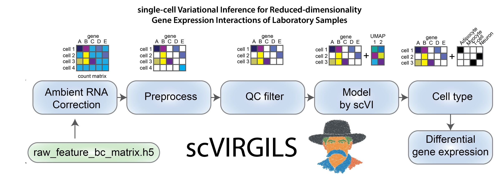

# scVIRGILS

## single-cell Variational-Inference for Reduced-dimensionality Gene-expression Interactions of Laboratory Samples

Focus on the analysis, not the processing. 

The workflow was built to minimize the time required to process data and get the single-cell scientist analyzing high-quality processed data and generating figures. We tried to strike a balance between giving the user control. The scripts and Snakemake pipeline work for the RNA sequencing datasets output from the 10X Genomics Single Cell kit (https://www.10xgenomics.com/blog/single-cell-rna-seq-an-introductory-overview-and-tools-for-getting-started), generated by the Single Cell Expert group at Center for Alzheimer's and Related Dementias at the NIH. The scRNAseq pipeline was built to take several batches of human brain single-nuclei sequencing samples and process them into a transcriptome atlas object for further analysis. 
 
The modules of Scanpy (https://github.com/scverse/scanpy) and SCVI (https://github.com/scverse/scvi-tools) are utilized heavily to produce an integrated atlas with minimal batch effects. 

## Pipeline

### To get started

Copy this repository to where you will be working with your data. This folder will be where output data is stored, while intermediary files will be stored in a separate folder to be defined by the user. It is important that the output of your CellRanger-ARC run has the format:`<data directory>/<Sample>/`!

Depending on the step you want scVIRGILS to run through, alter `rule all` accordingly. 

#### Required inputs:
- Metadata file in .csv format, example in `input/example_metadata.csv`. A minimal metadata file should include:
  - Sequencing batch, called Use_batch in example (indicating the separate sequencing folder for each run of `CellRanger-ARC`, denoted batch"Sequencing batch>"). This can also be "Sample" if you are integrating and batch correcting by Sample.
  - Sample ID, called Sample in the example, indicates where name of each sample.
  - Sample comparison, usually a disease or diagnosis, called 'Primary Diagnosis' in the example, as well for the values of this column;
    - Names of the control condition, called 'control' in the example
    - A list of conditions to compare to the control, called 'diseases' in the example
- Cell-typing table with marker genes, in .csv format, see example in `input/example_marker_genes.csv`
- Directory of the CellRanger output, the data here is the output of `CellRanger`, where each sample is contained in a separate data directory folder; starting with `<data_dir>/<sample>/raw_feature_bc_matrix.h5` for each sample. This is the entry point to the pipeline.

In addition, the `snakefile` requires modifications to fit your project. The top section "Parameter" should be modified for your dataset, include quality control values, where the input metadata and cell/cell gene marker files are stored. Input files should have their values match the parameters section.

#### Outputs:
- RNA atlas object (05_annotated_anndata_rna.h5ad)
- List of differentially expressed genes and accessible regions (data/significant_genes/<rna>/<celltype_disease_DGE>.csv
- Preprocessed and QC-filtered AnnData objects for each sample

#### Current version:
- Uses Singularity images for reproducible runs (scVI modeling will be slow until a GPU-enabled image is created)
- Snakemake runs steps until all output files are created
- Genes used for celltyping are input from `input/example_marker_genes.csv`
- RNA processing has to be done to run this pipeline 
- Data needs to be stored in a specific heirarchy
- Cellbender needs to be run after CellRanger to compensate for ambient RNA
- Differential Gene Expression and Differential Accessibility of Regions analysis are done 

Once set up, this complete pipeline can be run by simply typing `bash snakemake.sh` in terminal in an HPC running Slurm or by submitting a sbatch job with `sbatch snakemake.sh`. This is a work in progress and has not been tested on other devices. 

### Cellbender (rule cellbender)

This is the entry point into the pipeline. Raw output data from cellranger ('''raw_feature_bc_matrix.h5''') is read in and processed with Cellbender. Background RNA, including ambient RNA, is removed from each cell and a filtered output as well as QC metrics are provided.

### RNA processing (rule preprocess) 

Transcriptomic data from CellRanger-ARC-2.0 ('''cellbender_gex_counts_filtered.h5''') is read in and processed with Scanpy. QC metrics of percent mitochondria/ribosomal RNA, doublet probability, and cell cycle.

### RNA QC (rule filter_rna) 

Parameters from the processing step are used to filter the cells from each samples based on percent mitochondrial transcripts, probability of being a doublet, and the minimum number of genes observed per cell.

### Individual RNA sample merging into atlas (rule merge_filtered_rna)

Each individual RNA AnnData object are merged into a single QC-filtered object for downstream analysis. This isn't required to be run in a normal workflow.

### RNA modeling (rule rna_model) 

Filtered RNA samples are merged into an atlas and multidimensional scaling is performed. A copy of the atlas is made with mitochondiral and ribosomal transcripts removed and only the most variable genes kept. SCVI is used to model the embed dimensions of the atlas, with batch correction, followed by KNN, leiden clustering, and UMAP scaling.

### Cell-typing (rule annotate) 

Cell types of the modeled and clustered RNA atlas are estimated using over-representation analysis and a currated list of cell gene markers.

### Separate atlas into individual celltypes (rule export_celltypes)

Separate h5ad files for each cell type are extracted and saved.

### DGE Analysis (rule DGE)

Each cell type pseudobulked and analyzed for differentially expressed genes. 
